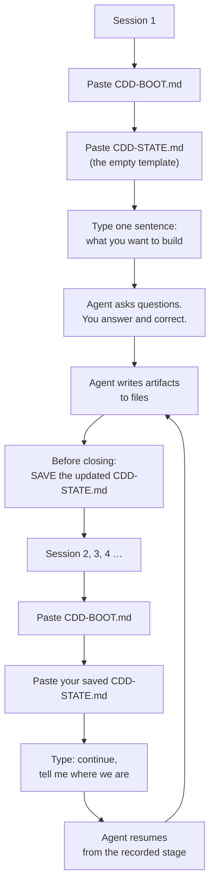

# Quick start

Everything you paste, in order, with a worked example of what comes back.

**The whole workflow is two files:**

| File | Role | Who writes it |
|---|---|---|
| `CDD-BOOT.md` | The behaviour specification. Self-contained — spec, constitution template, artifact templates, question bank. | The author. You never edit it. |
| `CDD-STATE.md` | The memory. What stage you are in, what is locked, what was decided, what was rejected. | The agent fills it in. **You carry it.** |

> **The one habit that makes this work**: before you close a session, copy the agent's updated `CDD-STATE.md` and save it. The chat is not storage. If you lose the state file, the next session starts from zero.

---

## Contents

- [At a glance](#at-a-glance)
- [Before the first session](#before-the-first-session)
- [Session 1 — what to paste](#session-1--what-to-paste)
- [Session 1 — a worked example](#session-1--a-worked-example)
- [Every later session](#every-later-session)
- [A later session — a worked example](#a-later-session--a-worked-example)
- [Session end — the one thing you must not skip](#session-end--the-one-thing-you-must-not-skip)
- [When the agent asks you to decide](#when-the-agent-asks-you-to-decide)
- [Where files end up](#where-files-end-up)
- [Troubleshooting](#troubleshooting)
- [Session checklist](#session-checklist)

---

## At a glance



Two pastes per session. One sentence from you. That is the entire interface.

---

## Before the first session

You need three things:

1. **An empty chat window** in any LLM harness — API chat, web UI, IDE agent, CLI. No tools required.
2. **A working directory** for the project. It can be empty; the agent will create the artifacts.
3. **A place to keep `CDD-STATE.md`.** This is not optional — see the warning above.

Nothing else. No installation, no accounts, no configuration.

> **If your harness can read files** (an IDE agent, a CLI agent, a repo-aware chat), you get a bonus: the agent can read the artifacts from disk instead of you pasting them. You still paste the two CDD files, because they define the behaviour.

---

## Session 1 — what to paste

Three steps, in this order. Send after each.

### Step 1 — paste the specification

Open `CDD-BOOT.md`, select all, paste, send.

### Step 2 — paste the state template

Open `CDD-STATE.md`, select all, paste, send.

### Step 3 — state your need in one sentence

Do not over-explain. Vague is expected; the agent's job is to make it precise.

```
Above is the CDD specification. Begin.

My need: an Android app for hotel management.
```

**That is everything.** The next thing you type will be an answer to a question.

> **Do not** paste your own PRD, design doc, or a paragraph of technical requirements. It is allowed, but it makes the agent skip the questioning phase that this whole model exists to provide. If you already have a precise specification, see [Troubleshooting](#troubleshooting).

---

## Session 1 — a worked example

Below is the shape of a real first exchange. Your project will differ; the **structure** is what to expect.

### What you sent

```
Above is the CDD specification. Begin.

My need: an Android app for hotel management.
```

### What comes back

```
[COST GATE] Money (room rates, deposits) + shared inventory (room-nights) + concurrent
            booking → FULL CDD.

[FAST PATH CHECK] goal: yes | platform: yes (Android) | ≥3 concrete ACs: no → fast path: no

[CURRENT STAGE] S0 Intake → folding into S1
[LOCKED ARTIFACTS] none
[THIS ROUND I WILL ASK] your understanding acknowledgment first

## UA-1 Requirements & Terminology Understanding Acknowledgment

| # | My understanding | Source | Status |
|---|---|---|---|
| 1 | A hotel property-management app for staff, not a guest-facing booking site | inferred | pending |
| 2 | Handles room inventory, bookings, check-in/check-out, and billing | inferred | pending |
| 3 | Android-only for now | inferred | pending |
| 4 | Single property, not a chain | inferred | pending |
| 5 | Room availability is shared mutable state — two staff must not sell the same room-night | inferred | pending |

### Needs your confirmation (affects downstream rework)

- Q1 Who uses it? Room nights are the shared resource, so the roles decide the
  concurrency and permission model.
  Options: (a) front desk only  (b) front desk + manager (rate changes, reports)
  (c) front desk + manager + housekeeping  (d) I don't know, decide for me
- Q2 How do bookings arrive? This decides whether inventory is authoritative here.
  Options: (a) all bookings entered in this app  (b) also walk-ins honoured from a paper
  book  (c) synced from an OTA or an existing PMS  (d) other
- Q3 Money: deposit at booking, payment at checkout, or both?
  Options: (a) payment at checkout only (simplest)  (b) deposit then balance at checkout
  (c) full prepayment
- Q4 What must explicitly NOT be built in the first version?
  Options: (a) multi-property  (b) OTA sync  (c) online guest booking  (d) housekeeping
  (e) all of them  (f) something else

### I decided these automatically (low impact — say so if you disagree)

- D1 App module layout: single `:app` module. Reason: no shared library boundary to
  enforce yet; a second module can be added when one appears.
- D2 UI framework: Jetpack Compose. Reason: default for new Android projects; no
  counter-indication given.

**How to confirm**: reply "delete <number>, change <number> to <content>, rest is correct".
**Until you confirm, I will not LOCK requirement.md or glossary.md, and I will not write any code.**
```

### What you do now

**You answer. You do not rewrite.** Keep it short:

```
1 is wrong — it's for the guest to book online too. 2 right. 3 right. 4 single property.
5 right.

Q1: (b) front desk + manager. Q2: (a) all bookings in this app, we don't use OTAs yet.
Q3: (a) checkout only. Q4: (e) all of them.
```

Four questions, four answers, one correction. **That is the pattern for the rest of the project.**

### What happens next

The agent:

1. Emits a **delta**, not a fresh table — `Changed: #1`, `Answered: Q1→(b)…`, `Still open: none`.
2. Asks the **next batch** — at most 8 questions, no more.
3. Repeats until every high-cost question is answered.
4. Writes `requirement.md` and `glossary.md`, then asks for **one** confirmation to lock them.

### Two things worth knowing early

**If you don't know an answer, say so.** `"I don't know"` is a valid reply. The agent must then give you options with costs, and if you still don't know, it takes a disclosed default and records where to reverse it. It is not allowed to keep asking.

**If the questions get tedious, say so.** `"too many questions, just decide"` is a valid instruction. The agent switches to disclosed defaults and moves on — see the patience-signal table in [CDD-BOOT.md §2.0](../CDD-BOOT.md).

---

## Every later session

Two pastes, one line, in this order.

### Step 1 — the specification (unchanged every time)

Paste all of `CDD-BOOT.md`.

### Step 2 — your saved state file

Paste all of `CDD-STATE.md` **as the agent left it** at the end of last session. Do not trim it, do not summarise it.

### Step 3 — resume

```
Above are the spec and last session's progress. Continue, and first tell me where we are.
```

That is the whole ritual. The agent reads the stage, the locked artifacts and the open items from the state file, and picks up.

> **If you also have `CDD-HISTORY.md`** (created once the state file passes 400 lines or 10 sessions), paste it **after** the state file — but only when you need to answer a *"why did we decide X"* question. It is not needed for normal resumption.

---

## A later session — a worked example

### What you sent

```
Above are the spec and last session's progress. Continue, and first tell me where we are.
```

### What comes back

```
[CURRENT STAGE] S5 Implementation — feature 001 (online booking + room inventory)
[LOCKED ARTIFACTS] requirement.md, glossary.md, specs/001/spec.md, specs/001/plan.md,
                  specs/001/contracts/
[THIS ROUND I WILL ASK] nothing yet — first, a re-anchor

Three decisions your last session locked, in case your thinking has moved:
  1. Payment at checkout only — no deposit (D-6)
  2. Inventory is authoritative in this app; no OTA sync in v1 (D-7)
  3. Two roles: front desk and manager (D-3)

Anything changed since last time?

Recorded from the state file:
  - pacing decision: (c) stop at phase boundaries
  - last completed task: T4 (availability query + reservation transaction)
  - open item: Q18 — whether I may add the RoomStore migration file
  - verification path: mandatory (money + shared inventory), committed (b) self-verification

If nothing has changed, say "continue" and I will resume at T5 under the recorded pacing.
```

### What you do

Either:

```
continue
```

…or correct the re-anchor first:

```
2 changed — we do need OTA sync eventually, but not in v1. Still continue.
```

The second form matters. **Corrections at the start of a session are cheap**; the same correction discovered after a prototype is built is expensive. That is why the agent re-anchors before doing work, and why answering it honestly is worth ten seconds.

### The pacing question

On the first session of implementation, the agent asks once:

```
How do you want me to pace implementation?
(a) Stop after each task — you review as we go
(b) Run through to the first runnable prototype, then stop and hand it to you
(c) Stop only at phase boundaries
```

Answer once; it is recorded in the state file. Most people pick **(b)**. You are not asked again.

---

## Session end — the one thing you must not skip

Before you close the window:

1. Find the agent's most recent full `CDD-STATE.md` output.
2. Copy it into your saved copy (a file on disk, a note, wherever you keep it).
3. Overwrite the previous version. **Do not accumulate copies** — the state file is the memory, and a stale copy is worse than none.

If the agent has not emitted the file recently and you are about to close, ask:

```
Emit the full updated CDD-STATE.md — I'm ending the session.
```

> **What it costs to forget**: one session of progress. The next session will resume from the last saved state and re-ask anything that was decided after that point.
>
> **What it does not cost**: the artifacts. `requirement.md`, `spec.md`, `plan.md` and the code live in your project directory and survive regardless. You lose the *bookkeeping*, not the work.

---

## When the agent asks you to decide

You will see three kinds of question. They need different replies.

### 1. `[NEEDS CLARIFICATION]` or a numbered question in a UA

**Answer it, or say you don't know.** Anything else gets recorded as an assumption.

### 2. `[SAFETY-NET DEFAULT]`

The agent is telling you it is taking a decision in a category that is never allowed to be decided silently — money, auth, inventory semantics, timezones, retention, external contracts, and so on.

```
[SAFETY-NET DEFAULT] category: money
  decision: deposit is 30% of the total, rounded down to the nearest yuan
  isolation: PaymentService.calculateDeposit() is the only place this lives
  recorded: CDD-STATE.md → Defaults Awaiting Confirmation
```

**Read the `isolation:` line.** It tells you how expensive the decision is to reverse. If it names one function, you can let it go and change your mind later. If the agent cannot name one place, say so — that means the decision is spread through the code and is worth resolving now.

### 3. A subjective complaint you made, coming back as options

You said *"the UI has no polish"*. The agent is not allowed to just start editing, and not allowed to ask *"what do you want it to look like?"*. It must come back with something like:

```
I've broken this into 3 dimensions, each with 2 options:

1. Spacing (current: 8/12/13/20px mixed)
   (a) Unify to an 8px grid   (b) Unify to a 4px grid   (c) Defer — judge from the next prototype
2. Hierarchy (current: everything has equal weight)
   (a) 3-level type scale     (b) Add sectioning and whitespace   (c) Defer
3. Feedback states (current: buttons don't change on press)
   (a) Add 4 states + loading   (b) Defer

Not addressed yet: colour, empty/error states, motion.

My recommendation: 1(a), 2(a), 3(a). Reason: spacing and hierarchy drive "polish"
most; colour is the most subjective, so I'd rather you judge it against something real.
```

**Pick one per dimension, or say "defer".** Deferring is a real answer, and usually the right one for anything subjective — it is much easier to judge a change against a running prototype than to imagine it from a description.

---

## Where files end up

The agent writes these into your project directory as the project progresses. You do not create them.

```
your-project/
├── CDD-BOOT.md                  you pasted it; keep it, it is versioned
├── CDD-STATE.md                 the memory — carried between sessions
├── CDD-HISTORY.md               archived history, created only when needed
├── CONSTITUTION.md              project-wide non-negotiables (checkable clauses)
├── requirement.md               what is being built, and why
├── glossary.md                  client vocabulary ↔ system concepts
└── specs/
    └── 001/
        ├── spec.md              acceptance criteria (decidable predicates)
        ├── plan.md              technical decisions, task breakdown, complexity ledger
        ├── contracts/           frozen interfaces — derived, never written twice
        ├── verification.md      per-criterion assertions + constructed counterexamples
        └── delivery-1.md        prototype handover note
```

**Stage names you will see**, in order: `S0` intake → `S1` requirements and terminology → `S3` spec lock → `S4` design → `S5` implementation → `S6` prototype delivery. `S7` is the feedback loop back into the spec, `S8` is rule writeback, `S9` is release (often skipped for a prototype).

There is no `S2`; terminology was merged into `S1` because two confirmation gates over one conversation was friction without benefit.

---

## Troubleshooting

**The agent started writing code without asking anything.**
It did not see the specification. Reply: `Read CDD-BOOT.md again before doing anything else.` If your harness cannot read files, re-paste it as the first message of a new session.

**It is asking too many questions.**
Say: `Stop asking, decide the rest yourself, I'll correct you.` The agent must then adopt disclosed defaults and proceed. This is a documented instruction, not a workaround.

**It is asking too few questions and guessing.**
Say: `List every assumption you have made, and I will confirm them one by one.` That forces a full understanding declaration.

**I already have a precise specification.**
Then the model has less to offer, but it is not useless — paste your spec and say: `Here is an existing spec. Verify it is decidable, find the gaps, and tell me what is under-specified before we start.` You get the review, and skip the elicitation.

**The state file has grown huge.**
It passed 400 lines or 10 sessions. Ask: `Archive the state file per your own rule — create CDD-HISTORY.md and keep only the live tables.` This rule exists in the spec and, in field use, was never executed until asked.

**A session crashed and I lost the state file.**
Recoverable, partially. Paste `CDD-BOOT.md` plus whatever artifacts exist (`requirement.md`, `spec.md`, `plan.md`) and say: `Reconstruct CDD-STATE.md from the artifacts in this repository. Mark anything you cannot determine from them as unknown rather than guessing.` You will lose the decision log and the rejected-options list — which is precisely why the save habit matters.

**The agent claims tests pass without showing output.**
Reply: `E3 — raw output or an explicit "harness unavailable" line.` The specification forbids the phrase "tests pass" as evidence.

---

## Session checklist

Print this, or keep it in a scratch note.

**First session**

```
[ ] Paste CDD-BOOT.md
[ ] Paste CDD-STATE.md (empty template)
[ ] Send one sentence: what you want to build
[ ] Answer the questions; correct what is wrong
[ ] Before closing: save the updated CDD-STATE.md
```

**Every later session**

```
[ ] Paste CDD-BOOT.md
[ ] Paste your saved CDD-STATE.md
[ ] Send: "Continue, and first tell me where we are."
[ ] Answer the re-anchor: has anything changed?
[ ] Work
[ ] Before closing: save the updated CDD-STATE.md
```

**When something feels wrong**

```
Too many questions      → "Stop asking, decide the rest yourself."
Too few, and guessing   → "List every assumption you have made."
No evidence shown       → "E3 — raw output, or say the harness is unavailable."
State file too long     → "Archive it per your own rule."
Work seems off-track    → "Show me the acceptance criteria this satisfies."
```

---

**[← Back to the main README](../README.md)**
